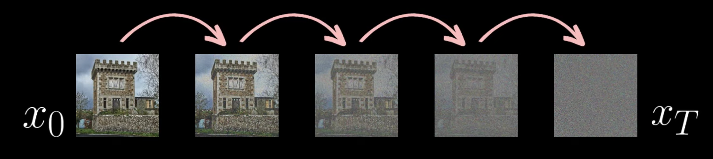
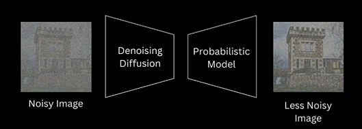

# EURECOM_Malis-StableDiffusion-project

# EURECOM_Malis-StableDiffusion-project

## What is it
Here I will give the steps to build a Diffusion algorithm. Originally made for medical image segmentation, they have also recently been used to 

DALL-E

Generative adversarial networks
=>

Random noise => Generator networks => Image

First step:
Take an image => add Gaussian noise over and over 

schedual
Linear schedual vs. 

# Steps

## Diffusion model

Basically give an image to the model that will apply Gaussian noise over and over for T terations. This will result in a stochastic image.

  

The forward process is the action of moving from $x_0$ to $x_T$.

This transition function (Conditional Gaussian distribution) is written as :

$q(x_t|x_{t-1}) \sim N(x_t; \sqrt{1 - \beta_t} x_{t-1}, \beta_t \mathbb{I}) $

with $\beta$ the variance schedule (how much noise we add for each step)
If $\beta$ large then the distribution will be wider. So samplig from it will give a noisier img.
The change of $\beta$ will be linear (but could also do sigmoid, quadratic, cosine)
$x_t$ the prevous (less noisy img)

0->255 becomes -1->1 after normalization

$x_t = \sqrt{1 - \beta} x_{t-1} + \sqrt{\beta} N(0, \mathbb{I})$

## UNET
U-NET is a convolution neural network model used for image segmentation, resoluton upcaling or image diffusion. It gets its name from the fact that the encoder and a decoder it is made up of is symetrical
U-Net is a great neural network because the size of the output is the same as the input.

The reverse: $p_{\theta}(x_{0:T}) = p(x_T) \prod_{t=1}^{T} p_{\theta}(x_{t-1}|x_t)$

At trainning we can sample from random timesteps
At sampling time we have to same for every timestps starting from pure noise

Made of:
* [ ] Contracting path - Decreases spacial dimension of the image
* Expanding path - Upsample feature map

### Contracting path

5 blocks in total

Assuming image is made up of one channel and is 572x572.

#### BLOCK 1
* Two 3x3 convolution layer (unpadded) with ReLU activation
* Channel are increased and kept at 64 channels
* One 2x2 max pooling layer (stride=2) => will downsample the image by half

#### BLOCK 2
* Two 3x3 convolution layer (unpadded) with ReLU activation
* Nbr of channels is doubled (128).
* One 2x2 max pooling layer (stride=2) => will downsample the image by half

## Denoising diffusion + probabilistic function

We then want our model to do the opposite by removing noise step by step until w get a clear image. 

  

Note: It is a Markov process $P(X_t|X_{t-1}, X_{t-2}, ..., X_{0}) = P(X_t|X_{t-1})$

Summary:
1. Take an image
2. Resize it, Normalize it, Tensor it
3. Compute the forward process to add noise to an image at random time $t$.
4. Give the noisy image at time $t$ to the U-NET. U-NET will try to output the noise added at time $t-1$.
5. Compare prediction of the U-NET with the noise added at time $t-1$. Store the specific loss
6. After finishing the whole batch, compute the accumulated loss (loss of all image of the batch).
7. We do this for multiple x=batch images and then updates the weight.

### Important notes
* one forward pass for each images in a batch (no double dip)
* THE GAUSSIAN NOISE IS TO BE STORED F WE WANT TO USE THE CLOSED SOLUTION
## Credits

### Videos

* [YT - The U-Net (actually) explained in 10 minutes](https://www.youtube.com/watch?v=NhdzGfB1q74&t=352s)
* [Denoising Diffusion Probabilistic Models | DDPM Explained](https://www.youtube.com/watch?v=H45lF4sUgiE)

### Articles
* [Medium - Diffusion Model from Scratch in Pytorch](https://towardsdatascience.com/diffusion-model-from-scratch-in-pytorch-ddpm-9d9760528946)
* [Why does the UNET double the number of feature channels after each Maxpooling layer?](https://www.quora.com/Why-does-the-UNET-double-the-number-of-feature-channels-after-each-Maxpooling-layer)
* [PDF - Diffusion Models and Normalizing Flows](https://deeplearning.cs.cmu.edu/F23/document/slides/lec23.diffusion.updated.pdf)

### Papers
* [U-Net: Convolutional Networks for Biomedical Image Segmentation](https://arxiv.org/pdf/1505.04597v1)

## Steps

Generator vs Discriminator

Forward problem
Generator

Noise scheduler
Neural network
Timestep encoding

Vanihing gradient 
mode collapse

slow sample speed

From the forward diffusion process to a closed solution

$q(x_t|x_{t-1}) = N(x_t; \sqrt{1 - \beta_t} x_{t-1}, \beta_t \mathbb{I}) $

Where:

* $x_t$ - The state of the data at time step $t$.
* $x_{t-1}$ - The state of the data at time step $t-1$.
* $\beta_{t}$ - The variance (level/influence/how much) of the noise to be added at time step $t$. This should follow (in MY implementation) a linear function. 
* $x_{t-1}$ - The state of the data at time step $t-1$.

  
Example implementation

  
  ### Part 1: Scale the data

  Calculate: $\sqrt{1-\beta_t}$

  Multiply: $\sqrt{1-\beta_t}$ with $x_{t-1}$

  ### Part 2: Add scaled noise

  Calculate: $\sqrt{\beta_t}$

  Calculate: The Gaussian noise $\epsilon$

  Multiply: $\sqrt{\beta_t}$ with the Gaussian noise $\epsilon$

  ### Part 2: Add part 1 and 2
  $x_{t+1} = p1 + p2$

  
Example implementation (for a CLOSED solution)

  
  ### Part 1: Calculate the cumulative product of $\bar\alpha_t$

  Reminder: $\bar\alpha_t = \prod_{i=1}^t (1-\beta_i)$

  Calculate: $\bar\alpha_t$

  Multiply: $\bar\alpha_t$ with $x_0$

  ### Part 2: Add cummulative scaled noise

  Calculate: $\sqrt{\bar\alpha_t}$

  Multiply: $\sqrt{\bar\alpha_t}$ with the Gaussian noise $\epsilon$

  ### Part 2: Add part 1 and 2
  $x_{t} = p1 + p2$

spatial information vs 
---

Closed form solution:
$q(x_t|x_{0}) = N(x_t; \sqrt{\bar\alpha_t} x_{t-1}, (1-\bar\alpha_t) \mathbb{I}) $

Where:

$\alpha_t = 1 - \beta_t$

$\bar\alpha_t = \prod_{i=1}^t \alpha_i$

Reverse:
$q(x_{t-1}|x_t) = N(x_{t-1}; \mu_q, \sum_q)$

### Batch

The batch size is a hyperparameter that defines the number of samples to work through before updating the internal model parameters.